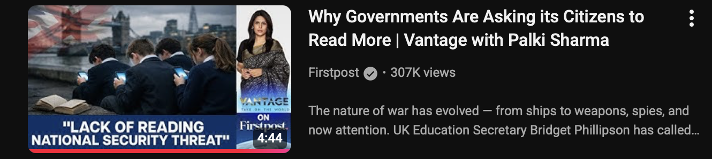

# 📚 The Reader's Nook

- **The Reader’s Nook** is a web-based library created to promote the habit of reading in an era dominated by short attention spans and digital distractions.

- The website provides **free access to books** that users can:
  - Read online  
  - Download at no cost  

- Readers can also:
  - Discover their next read through the **Recommendations** section available in the footer  
  - Explore a broader world of books and resources via the **Library** section in the footer  
  - Read reviews of others via the **Review** section available in the footer

-> My point of view 
  	•	📖 I am a mixed-genre reader who genuinely enjoys exploring ideas through books across fiction and non-fiction.
	•	Reading has shaped the way I think, analyze, and reflect on the world beyond quick opinions and surface-level information.
	•	I strongly resonate with the idea that
        “A good reader makes a good leader.”
        because reading develops clarity, patience, empathy, and critical thinking.
	•	History and experience repeatedly show that
        “All great leaders are readers.”
        not because they seek authority, but because they seek understanding.
	•	This belief inspired me to take the initiative and build The Reader’s Nook — a space that encourages thoughtful reading in an age of shrinking attention spans.
	•	Through this project, I aim to grow personally, nurture leadership qualities through reading, and inspire others to pause, reflect, and learn through books

- 💡 **How I came across this idea**
  - The idea for this project came after I watched and reflected on a discussion highlighting the **global decline in reading habits**.
  - The video explained how reduced reading affects attention span, critical thinking, and makes individuals more vulnerable to misinformation.
  - It emphasized that reading today is no longer just a hobby — it is becoming a vital life skill.

- 🎥 **Inspiration Behind the Project**

  

    

  🔗 https://youtu.be/MvDLpmjrtUo?si=cVXP_CHYkUAZvuBe

- 🌍 The discussion also highlighted that:
  - Governments and educators worldwide are encouraging reading habits
  - Reading helps combat misinformation
  - Excessive screen time is weakening focus and patience
  - Attention is emerging as one of the most valuable resources of the modern age  

- 🛠 **Technologies Used**
  - **HTML** – for structuring the website  
  - **CSS** – for styling, layout, and responsiveness  

- 🎯 **Purpose of the Project**
  - Encourage mindful reading  
  - Reduce endless scrolling and screen fatigue  
  - Make quality books freely accessible  

- ✨ **Core Message**
  - *Pause. Read. Think. Grow.*
